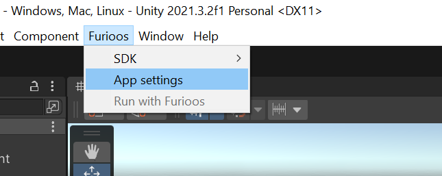
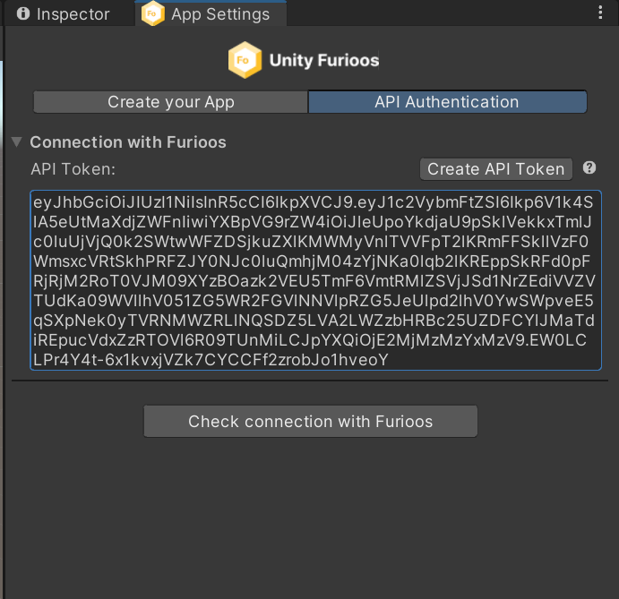
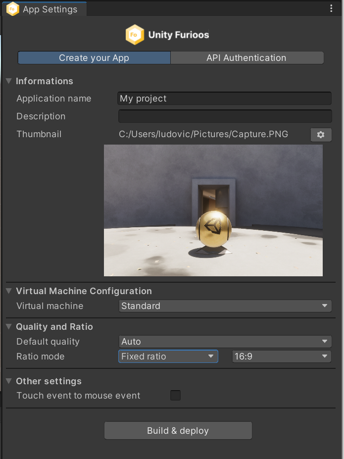
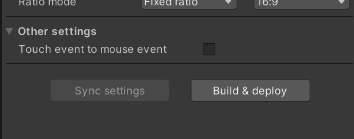
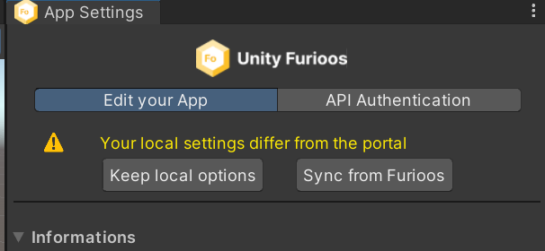

# Furioos Exporter

## Why using it

Use the Furioos Unity Exporter, to export your application from Unity to Furioos, or modify your settings with one click.
This package uses the Furioos API. If you want to use it, you can find the documentation [here](https://api.furioos.com/v1/api-docs)

## Requirements

- A Furioos Account on [Furioos.com](https://portal.furioos.com)
- A Furioos API Token
- Unity Editor 2020.3+

## Installation

Follow the installation instructions [here](../README.md#installation)

> ***Important**: Furioos Unity Package uses the UPM (Unity Package Manager) but it's still an experimental package. Which means that you don't find it directly from the Unity Registry. Follow the steps below to install it*

## How to use it

### Connection with Furioos

Once the installation is completed, the Furioos menu is available.

1. Click on Furioos > App settings to display the Furioos Unity Exporter window\
   

2. Click on the API Authentification tab to add your Furioos API token and activate the communication between the Unity Editor and Furioos\
   

3. Click on the API Authentification tab to add your Furioos API token and activate the communication between the Unity Editor and Furioos\
   

4. The connection is tested automatically but you can force this verification by clicking on "Check connection with Furioos".

### First deploy

By default, the application name is set with the product name (in Player Settings > Player).
You can set up :

- Application name (required)
- Description
- Thumbnail with the format (png, jpg, gif). and 3Mb max
- Virtual machine
  - **Standard (by default)**
  - High
  - Extreme
- Quality
  - **Auto (by default)**
  - High (1080p - 60fps)
  - Medium (720p - 30 fps)
  - Low (320p - 30fps)
- Ratio mode
  - Dynamic ratio ( requires dynamic app)
  - Force Landscape mode ( requires dynamic app)
  - Force Portrait mode ( requires dynamic app)
  - **Fixed ratio (by default with 16:9)**
    - choice your ratio from the list
    - set up manually
- Touch event

> ***Notes**: After choosing your settings you can click on "Build & Deploy" to export your application on Furioos.
> The Furioos exporter gets the scenes that have been selected from "Build settings" and creates a zip file with the windows application.*

### Update your deployment

After your first deployment, you can either:

- Update your configuration by clicking on "Sync settings". This action only sends the new settings to Furioos
- Relaunch a Build & Deploy. To recreate and export your application. Your settings will also be updated.

### Bidirectional settings

The Exporter checks your settings on the Furioos side. If a change is detected, two buttons are displayed to choose what you want to do.

- Keep local options: Your settings local are kept and sent to Furioos.
- Sync from Furioos. The settings are updated from Furioos.

