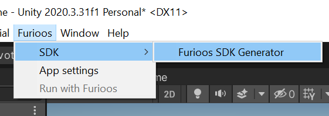
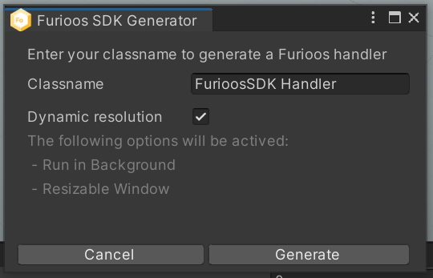
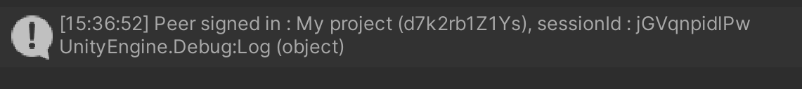
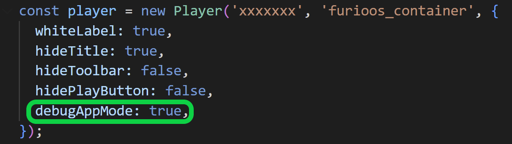
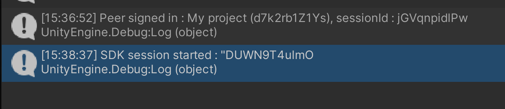

# Furioos SDK Unity

## Why using it

With the Furioos SDK Unity, you can embed your Unity application in your website and make them communicate with each other in a bidirectional way.


**You can:**

- send/receive messages from your website to your Unity application
- send/receive messages from your Unity application to your website

### Examples

If you want to create a way to change the color of a GameObject using a color picker on your website\


- When changing color, send a message from the web client by using Furioos JS SDK with the selected color code
- The Unity application receives the message
- Parse the message in your script and identify the action "Change color"
- Check the color value
- Changes the GameObject material color

If you want to get the player position from your Unity application for showing on your website\


- When the player position change, the Unity application sends a message with the new coordinates.
- The web client receives the message
- Parse the message in your script and identify the action "Player position"
- Checks the coordinates value
- Display the player coordinates on your website

## Requirements

- Unity Editor 2020.3+
- A Furioos Account on [Furioos.com](https://portal.furioos.com)
- The Furioos SDK JS in your Web site [GitHub Pages](https://github.com/Unity-Technologies/furioos-sdk-js)

## Installation

Please follow the installation instructions [here](../README.md#installation)

> ***Important**: Furioos Unity Package uses the UPM (Unity Package Manager) but it's still an experimental package. Which means that you don't find it directly from the Unity Registry. Follow the steps below to install it*

## How to use

Once the installation is completed, the Furioos menu is available.

1. Click on Furioos > SDK > Generate Furioos SDK Handler\
   

2. Choose your class name to generate the script and GameObject.\
   

> ***Note**: By default, the Dynamic resolution is checked and added to your project.*

3. Click on generate

As soon as the generation is over, a GameObject is created with two components (with default options):

- The first script is the Furioos SDK Handler (You can find it in Assets/Scripts/Furioos)
- The second script is the Dynamic resolution script

> ***Important**: Repeat this operation in each scene where you want to use the SDK. If you want to reuse the same SDK Handler, create just an empty GameObject and add your SDK Handler script.*

### FurioosSDKHandler Sample

```C#
using Newtonsoft.Json;
using Newtonsoft.Json.Linq;
using UnityEngine;
using Furioos.SDK;

public class FurioosSDKHandler : MonoBehaviour
{
    private FurioosSDK sdk;

    void OnEnable()
    {
        this.sdk = gameObject.AddComponent<FurioosSDK>();
        this.sdk.OnSDKMessage += this.OnSDKMessage;
        this.sdk.OnSDKSessionStart += this.OnSDKSessionStart;
        this.sdk.OnSDKSessionStop += this.OnSDKSessionStop;
    }

    void OnDisable()
    {
        this.sdk.OnSDKMessage -= this.OnSDKMessage;
        this.sdk.OnSDKSessionStart -= this.OnSDKSessionStart;
        this.sdk.OnSDKSessionStop -= this.OnSDKSessionStop;
    }

    private void OnSDKSessionStart(string from)
    {
        Debug.Log("SDK session started : \"" + from);
    }

    private void OnSDKSessionStop(string from)
    {
        Debug.Log("SDK session stopped : \"" + from);
    }

    public void OnSDKMessage(JToken data, string from)
    {
        var value = JsonConvert.SerializeObject(data);
        Debug.Log("SDK data from \"" + from + "\" : \n" + value);
    }

    void Update()
    {
        if (Input.GetKeyUp(KeyCode.Return))
        {
            string jsonMessage = "{action:\"test\"}";
            Debug.Log("Send Message to client: "+ jsonMessage);
            this.sdk.send(JObject.Parse(jsonMessage));
        }
    }
}
```

## Events

#### OnSDKSessionStart(string from)

Bind an even called when a web client is connected to the application.

- `string from`: peerId is the Id of the connected web client

#### OnSDKSessionStop(string from)

Bind an event called when a web client is disconnected from the application.

- `string from`: peerId is the Id of the connected web client

#### OnSDKMessage(JToken data, string from)

Bind an event called every time data is received.

- `JToken data`: data received from the client. Test the type of data with the `JTokenType enum`. If you use an object you can convert it with the method `data.ToObject<T>()`.
- `string from`: peerId is the Id of the connected web client

## Methods

#### void send(string data [,string dstPeerId = ""])

Send a string data to the web client

- `string data`: the message send in string format
- `[string dstPeerId]` : Web client who should receive the message. If the value is empty, the message is sent to all clients.

#### void send(JObject data [,string dstPeerId = ""])

Send an object data to the web client

- `JObject data`: the message send in Json format
- `[string dstPeerId]` : Web client who should receive the message. If the value is empty, the message is sent to all clients.

## Debug mode

The Furioos SDK Unity provides a local debug mode, to facilitate the debugging of sending and receiving messages.

### How to use it

#### Unity Side

Nothing to configure. When you start your application(With Furioos SDK Unity) with the play button in the Unity Editor, the local debug mode is automatically enabled.
You can check it in the unity console. A message must be displayed:



> ***Note**: You may get the message "connection lost" at startup. Don't worry. It is the time for the communication between the SDK and the debugger to be done.*

> *However, if you get a lot of "connection lost". Stop your application or restart the Unity Editor*

#### Webclient Side (Unity SDK JS)

To enable debugging mode you have to set the debugAppMode property to true.



Please start your application and refresh your web client to connect them.
If the connection is ok, you should see the following two messages in your console.


